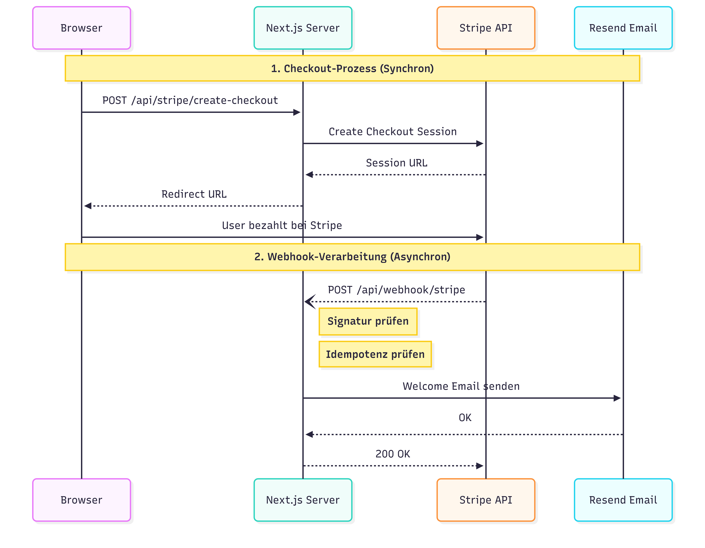
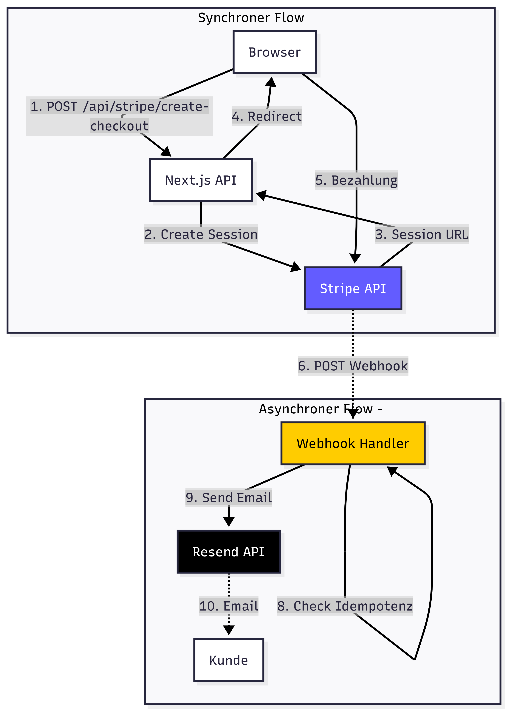

# Verteilte Systeme - Einsendeaufgabe AIT2

**Modul**: AIT2 - Verteilte Systeme
**Hochschule**: Ferdinand Porsche FernFH
**Projekt**: Die Produktivitäts-Werkstatt (Video-Kurs-Plattform)
**Technologie**: Next.js 15 / TypeScript / React 19

---

## Inhaltsverzeichnis

1. [Projektübersicht](#projektübersicht)
2. [Verteilte Systemkomponenten](#verteilte-systemkomponenten)
3. [Fokus: Payment-Flow mit Webhook](#fokus-payment-flow-mit-webhook)
4. [Implementierungsdetails](#implementierungsdetails)
5. [Konzepte verteilter Programmierung](#konzepte-verteilter-programmierung)
6. [Quellcode-Struktur](#quellcode-struktur)
7. [Installation & Ausführung](#installation--ausführung)

---

## Projektübersicht

Die **Produktivitäts-Werkstatt** ist eine deutschsprachige Video-Kurs-Plattform mit ~75 Lektionen über 12 Module. Die Plattform demonstriert mehrere Konzepte verteilter Systeme:

- **Service-zu-Service Kommunikation** (HTTP/REST)
- **Event-Driven Architecture** (Webhooks)
- **Asynchrone Verarbeitung** (Email-Versand)
- **Idempotenz-Handling** (Webhook-Deduplizierung)

---

## Verteilte Systemkomponenten

| Komponente | Kommunikationsart | Protokoll | Externe APIs |
|------------|-------------------|-----------|--------------|
| **Stripe Payment** | Synchron + Async (Webhook) | HTTPS/REST | Stripe API |
| **Resend Email** | Synchron REST | HTTPS/JSON | Resend API |
| **Client APIs** | Request/Response | HTTP/JSON | Intern |

---

## Fokus: Payment-Flow mit Webhook

Die **Stripe Payment Integration** ist das Hauptbeispiel für verteilte Programmierung in diesem Projekt, da sie mehrere Konzepte kombiniert:

### Sequenzdiagramm: Stripe Payment Flow



### Flowchart: Stripe Payment Flow



**Ablauf:**

| Phase | Schritt | Beschreibung | Kommunikationsart |
|-------|---------|--------------|-------------------|
| **1. Checkout** | Browser → Server | POST /api/stripe/create-checkout | Synchron |
| | Server → Stripe | Create Checkout Session | Synchron (REST) |
| | Stripe → Server | Session URL | Response |
| | Server → Browser | Redirect URL | Response |
| | Browser → Stripe | User bezahlt | Redirect |
| **2. Webhook** | Stripe → Server | POST /api/webhook/stripe | **Asynchron** |
| | Server | Signatur prüfen | Intern |
| | Server | Idempotenz prüfen | Intern |
| | Server → Resend | Welcome Email senden | Synchron (REST) |
| | Server → Stripe | 200 OK | Response |

### Warum ist dies ein Paradebeispiel?

| Konzept | Implementierung | Datei |
|---------|-----------------|-------|
| **Asynchrone Kommunikation** | Stripe sendet Webhook nach Zahlungsabschluss | `src/app/api/webhook/stripe/route.ts` |
| **At-least-once Delivery** | Stripe wiederholt bei HTTP-Fehlern | Stripe Retry-Policy |
| **Idempotenz** | Webhook-Events werden dedupliziert | `src/libs/webhookStore.ts` |
| **Signatur-Verifizierung** | HMAC-basierte Authentifizierung | `stripe.webhooks.constructEvent()` |
| **Service-Orchestrierung** | Stripe → Server → Resend Email | Multi-Service-Flow |
| **Error Handling** | HTTP 500 triggert Stripe-Retry | Try/Catch mit Status-Codes |

---

## Implementierungsdetails

### 1. Checkout-Session erstellen (Synchron)

**Datei**: `src/app/api/stripe/create-checkout/route.ts`

```typescript
export async function POST(req: Request) {
  // 1. Rate-Limiting prüfen
  const rate = await checkRateLimit({ key: `checkout:${ip}`, limit: 20, windowMs: 60_000 });
  if (!rate.ok) {
    return NextResponse.json({ error: "Rate limit exceeded" }, { status: 429 });
  }

  // 2. Input-Validierung mit Zod
  const parsed = checkoutSchema.safeParse(body);
  const { successUrl, cancelUrl, productType } = parsed.data;

  // 3. Redirect-URL Validierung (Security)
  if (!isAllowedRedirect(successUrl) || !isAllowedRedirect(cancelUrl)) {
    return NextResponse.json({ error: "Redirect URLs not allowed" }, { status: 400 });
  }

  // 4. Stripe API aufrufen (synchroner REST-Call)
  const { createCheckout } = await import("@/libs/stripe");
  const url = await createCheckout({ successUrl, cancelUrl, productType });

  return NextResponse.json({ url });
}
```

**Konzepte**:
- Synchrone Request/Response-Kommunikation
- Input-Validierung (Zod Schema)
- Rate-Limiting zum Schutz vor Missbrauch
- URL-Whitelist gegen Open Redirect Attacks

### 2. Webhook-Handler (Asynchron)

**Datei**: `src/app/api/webhook/stripe/route.ts`

```typescript
export async function POST(req: NextRequest) {
  // 1. Webhook-Secret prüfen
  const webhookSecret = process.env.STRIPE_WEBHOOK_SECRET;
  if (!webhookSecret) {
    return NextResponse.json({ error: "Webhook secret not configured" }, { status: 500 });
  }

  // 2. Signatur verifizieren (HMAC-basierte Authentifizierung)
  const body = await req.text();
  const signature = headers().get("stripe-signature");
  const event = stripe.webhooks.constructEvent(body, signature, webhookSecret);

  // 3. Idempotenz prüfen (At-least-once → Exactly-once)
  const reserved = await reserveWebhookEvent(event.id);
  if (!reserved) {
    return NextResponse.json({ ok: true, duplicate: true });
  }

  // 4. Business-Logik: Email senden
  await sendEmail({
    to: email,
    subject: welcomeEmailSubject,
    html: welcomeEmail(magicLink),
  });

  // 5. Event als verarbeitet markieren
  await markWebhookProcessed(event.id);

  return NextResponse.json({ ok: true });
}
```

**Konzepte**:
- Event-Driven Architecture (Push-Modell)
- Kryptographische Signatur-Verifizierung
- Idempotenz-Handling (3-Phasen: Reserve → Process → Mark)
- Multi-Service-Orchestrierung

### 3. Idempotenz-Store

**Datei**: `src/libs/webhookStore.ts`

```typescript
// Dual-Storage: PostgreSQL in Production, File-basiert in Development
const hasDb = !!process.env.DATABASE_URL || !!process.env.POSTGRES_URL;

export async function reserveWebhookEvent(eventId: string): Promise<boolean> {
  if (hasDb) {
    // PostgreSQL: INSERT mit ON CONFLICT DO NOTHING
    const inserted = await sql`
      INSERT INTO webhook_events (event_id) VALUES (${eventId})
      ON CONFLICT DO NOTHING
      RETURNING event_id
    `;
    return (inserted.rowCount ?? 0) > 0;
  }

  // File-basiert mit Mutex für Thread-Safety
  return withLock("webhook-file", async () => {
    const data = readFileStore();
    if (data[eventId]) return false;  // Bereits verarbeitet
    data[eventId] = { eventId, processed: false, createdAt: new Date().toISOString() };
    writeFileStore(data);
    return true;
  });
}
```

**Konzepte**:
- Idempotenz durch Event-ID Deduplizierung
- Dual-Storage Pattern (DB/File Fallback)
- Mutex für Thread-Safety bei File-Operationen
- Atomare Writes (tmp → rename)

### 4. Rate-Limiting

**Datei**: `src/libs/rateLimit.ts`

```typescript
// Fixed-Window Rate Limiter mit optionalem Postgres-Backend
export async function checkRateLimit(options: {
  key: string;
  limit: number;
  windowMs: number;
}): Promise<RateLimitResult> {
  if (hasDb) {
    return await checkDbLimit(key, limit, windowMs);  // Persistent über Restarts
  }
  return checkMemoryLimit(key, limit, windowMs);  // In-Memory für Dev
}
```

**Konzepte**:
- Fixed-Window Algorithmus
- Graceful Degradation (DB → Memory Fallback)
- Schutz vor API-Missbrauch

---

## Konzepte verteilter Programmierung

### Implementierte Patterns

| Pattern | Beschreibung | Implementierung |
|---------|--------------|-----------------|
| **Request/Response** | Synchrone Kommunikation | Stripe Checkout API |
| **Webhook/Callback** | Asynchrone Event-Benachrichtigung | Stripe → Server |
| **Idempotenz** | Mehrfachausführung verhindern | `webhookStore.ts` |
| **Rate Limiting** | API-Überlastung verhindern | `rateLimit.ts` |
| **Mutex** | Thread-Safety bei File-Ops | `mutex.ts` |

### Fehlerbehandlung

| HTTP Status | Bedeutung | Stripe Reaktion |
|-------------|-----------|-----------------|
| **200 OK** | Erfolgreich verarbeitet | Kein Retry |
| **400 Bad Request** | Ungültige Signatur | Kein Retry |
| **500 Internal Error** | Transient Failure | Automatischer Retry |

```typescript
// Error Handling im Webhook
try {
  await sendEmail({ to, subject, html });
  await markWebhookProcessed(event.id);
} catch (err) {
  await releaseWebhookReservation(event.id);  // Für Retry freigeben
  throw err;  // 500 → Stripe wiederholt
}
```

---

## Quellcode-Struktur

### Enthaltene Dateien

```
src/
├── app/api/
│   ├── stripe/create-checkout/
│   │   └── route.ts              # Checkout-Session erstellen
│   └── webhook/stripe/
│       └── route.ts              # Webhook-Handler (Hauptbeispiel)
├── libs/
│   ├── stripe.ts                 # Stripe SDK Wrapper
│   ├── webhookStore.ts           # Idempotenz-Speicher
│   ├── resend.ts                 # Email-Client
│   ├── rateLimit.ts              # Rate-Limiting
│   ├── mutex.ts                  # Async Mutex
│   ├── logger.ts                 # Structured Logging
│   └── requestIp.ts              # IP-Extraktion
├── emails/
│   └── welcome.ts                # Email-Template
├── types/
│   ├── products.ts               # Produkt-Typen
│   └── config.ts                 # Config-Interface
└── config.ts                     # App-Konfiguration
```

### Datei-Übersicht

| Datei | Zeilen | Beschreibung |
|-------|--------|--------------|
| `webhook/stripe/route.ts` | 135 | **Hauptbeispiel**: Webhook mit Signatur, Idempotenz, Email |
| `create-checkout/route.ts` | 129 | Checkout mit Rate-Limit, Validation, URL-Whitelist |
| `webhookStore.ts` | 142 | Idempotenz mit DB/File Dual-Storage |
| `rateLimit.ts` | 115 | Fixed-Window Rate Limiter |
| `stripe.ts` | 115 | Stripe SDK Integration |
| `mutex.ts` | 37 | Async Mutex für File-Locking |

---

## Installation & Ausführung

### Voraussetzungen

- Node.js >= 18
- npm

### Setup

```bash
# Repository klonen
git clone https://github.com/codeme-ne/esa-verteilte-systeme.git
cd esa-verteilte-systeme

# Das vollständige Projekt (mit allen Dependencies) finden Sie unter:
# https://github.com/codeme-ne/die-produktivitaets-werkstatt
```

### Erforderliche Environment-Variablen

```bash
# Stripe (Payment)
STRIPE_SECRET_KEY=sk_test_...
STRIPE_WEBHOOK_SECRET=whsec_...

# Resend (Email)
RESEND_API_KEY=re_...

# Optional: PostgreSQL für Produktion
DATABASE_URL=postgres://...
```

### Testen des Payment-Flows

1. Dev-Server starten: `npm run dev`
2. Checkout aufrufen: `POST /api/stripe/create-checkout`
3. Stripe Test-Karte verwenden: `4242 4242 4242 4242`
4. Webhook lokal testen: `stripe listen --forward-to localhost:3000/api/webhook/stripe`

---

## Fazit

Dieses Projekt demonstriert zentrale Konzepte verteilter Systeme:

1. **Service-Integration**: Stripe + Resend APIs
2. **Asynchrone Kommunikation**: Webhook-basierter Payment-Flow
3. **Fehlertoleranz**: Retry-Mechanismen, Graceful Degradation
4. **Idempotenz**: Event-Deduplizierung mit Dual-Storage
5. **Sicherheit**: HMAC-Signaturen, Rate-Limiting

Die gewählte Teilfunktionalität (Stripe Payment + Webhook + Email) zeigt, wie moderne Web-Anwendungen mehrere verteilte Services orchestrieren.

---

**Autor**: Lukasz Angerl
**Datum**: Januar 2026
**Repository**: https://github.com/codeme-ne/esa-verteilte-systeme
