# Verteilte Systeme - Einsendeaufgabe AIT2

**Modul**: AIT2 - Verteilte Systeme
**Hochschule**: Ferdinand Porsche FernFH
**Projekt**: Die Produktivitäts-Werkstatt (Video-Kurs-Plattform)
**Technologie**: Next.js 15 / TypeScript / React 19

---

## Inhaltsverzeichnis

1. [Projektübersicht](#projektübersicht)
2. [Verteilte Systemkomponenten](#verteilte-systemkomponenten)
3. [Fokus: Payment-Flow mit Webhook](#fokus-payment-flow-mit-webhook)
4. [Architektur-Diagramm](#architektur-diagramm)
5. [Implementierungsdetails](#implementierungsdetails)
6. [Konzepte verteilter Programmierung](#konzepte-verteilter-programmierung)
7. [Installation & Ausführung](#installation--ausführung)
8. [Quellcode-Struktur](#quellcode-struktur)

---

## Projektübersicht

Die **Produktivitäts-Werkstatt** ist eine deutschsprachige Video-Kurs-Plattform mit ~75 Lektionen über 12 Module. Die Plattform demonstriert mehrere Konzepte verteilter Systeme:

- **Service-zu-Service Kommunikation** (HTTP/REST)
- **Event-Driven Architecture** (Webhooks)
- **Asynchrone Verarbeitung** (Email-Versand)
- **Authentifizierung über Token** (JWT)

---

## Verteilte Systemkomponenten

| Komponente | Kommunikationsart | Protokoll | Externe APIs |
|------------|-------------------|-----------|--------------|
| **Stripe Payment** | Synchron + Async (Webhook) | HTTPS/REST | Stripe API |
| **Bunny.net Video** | Synchron REST | HTTPS/JSON | Bunny CDN API |
| **Resend Email** | Synchron REST | HTTPS/JSON | Resend API |
| **Magic Link Auth** | Multi-Step (Server→Email→Client) | HTTP + SMTP | Resend API |
| **Client APIs** | Request/Response | HTTP/JSON | Intern |

---

## Fokus: Payment-Flow mit Webhook

Die **Stripe Payment Integration** ist das beste Beispiel für verteilte Programmierung in diesem Projekt, da sie mehrere Konzepte kombiniert:

### Sequenzdiagramm: Stripe Payment Flow


### Flowchart: Stripe Payment Flow


**Ablauf:**

| Phase | Schritt | Beschreibung | Kommunikationsart |
|-------|---------|--------------|-------------------|
| **1. Checkout** | Browser → Server | POST /api/stripe/create-checkout | Synchron |
| | Server → Stripe | Create Checkout Session | Synchron (REST) |
| | Stripe → Server | Session URL | Response |
| | Server → Browser | Redirect URL | Response |
| | Browser → Stripe | User bezahlt | Redirect |
| **2. Webhook** | Stripe → Server | POST /api/webhook/stripe | **Asynchron** |
| | Server | Signatur prüfen | Intern |
| | Server | Idempotenz prüfen | Intern |
| | Server → Resend | Welcome Email senden | Synchron (REST) |
| | Server → Stripe | 200 OK | Response |

### Warum ist dies ein Paradebeispiel?

| Konzept | Implementierung | Datei |
|---------|-----------------|-------|
| **Asynchrone Kommunikation** | Stripe sendet Webhook nach Zahlungsabschluss | `app/api/webhook/stripe/route.ts` |
| **At-least-once Delivery** | Stripe wiederholt bei HTTP-Fehlern | Stripe Retry-Policy |
| **Idempotenz** | Webhook-Events werden dedupliziert | `reserveWebhookEvent()` |
| **Signatur-Verifizierung** | HMAC-basierte Authentifizierung | `stripe.webhooks.constructEvent()` |
| **Service-Orchestrierung** | Stripe → Server → Resend Email | Multi-Service-Flow |
| **Error Handling** | HTTP 500 triggert Stripe-Retry | Try/Catch mit Status-Codes |

---

## Architektur-Diagramm

### Gesamtübersicht



### Komponenten

| Schicht | Komponenten | Technologie |
|---------|-------------|-------------|
| **Frontend** | React App, JWT Cookie | Next.js 15, React 19 |
| **Backend** | API Routes, Middleware | Next.js App Router |
| **Externe Services** | Payment, Video, Email | Stripe, Bunny.net, Resend |
| **Persistenz** | Progress, Releases | File-JSON / PostgreSQL |

---

## Implementierungsdetails

### 1. Checkout-Session erstellen (Synchron)

**Datei**: `app/api/stripe/create-checkout/route.ts`

```typescript
// Vereinfachter Code-Ausschnitt
export async function POST(req: Request) {
  // Input-Validierung mit Zod
  const { successUrl, cancelUrl, productType } = parsed.data;

  // Stripe API aufrufen (synchroner REST-Call)
  const { createCheckout } = await import("@/libs/stripe");
  const url = await createCheckout({ successUrl, cancelUrl, productType });

  return NextResponse.json({ url });
}
```

**Konzept**: Synchrone Request/Response-Kommunikation mit externer API

### 2. Webhook-Handler (Asynchron)

**Datei**: `app/api/webhook/stripe/route.ts`

```typescript
// Vereinfachter Code-Ausschnitt
export async function POST(req: NextRequest) {
  // 1. Signatur verifizieren (Sicherheit)
  const event = stripe.webhooks.constructEvent(body, signature, webhookSecret);

  // 2. Idempotenz prüfen (At-least-once → Exactly-once)
  const reserved = await reserveWebhookEvent(event.id);
  if (!reserved) {
    return NextResponse.json({ ok: true, duplicate: true });
  }

  // 3. Email senden (Service-Orchestrierung)
  await sendEmail({
    to: email,
    subject: welcomeEmailSubject,
    html: welcomeEmail(magicLink),
  });

  // 4. Verarbeitung markieren
  await markWebhookProcessed(event.id);

  return NextResponse.json({ ok: true });
}
```

**Konzepte**:
- Event-Driven Architecture
- Idempotenz-Handling
- Kryptographische Signatur-Verifizierung
- Multi-Service-Orchestrierung

### 3. Bunny.net Video-API (REST)

**Datei**: `libs/bunnyStream.ts`

```typescript
// REST-Client mit Timeout und Retry-Logik
export async function getVideoMeta(libraryId: string, guid: string) {
  const controller = new AbortController();
  const timeoutId = setTimeout(() => controller.abort(), timeout);

  const response = await fetch(url, {
    headers: { AccessKey: apiKey },
    signal: controller.signal,
  });

  return await response.json();
}

// Batch-Abruf mit Rate-Limiting
export async function getVideosMetaBatch(videos, options) {
  const { rateLimit = 10, maxRetries = 3, retryDelay = 1000 } = options;
  // Exponential Backoff bei Fehlern
  // Rate-Limiting zwischen Requests
}
```

**Konzepte**:
- Timeout-Handling
- Exponential Backoff
- Rate-Limiting
- Batch-Verarbeitung

---

## Konzepte verteilter Programmierung

### Implementierte Patterns

| Pattern | Beschreibung | Implementierung |
|---------|--------------|-----------------|
| **Request/Response** | Synchrone Kommunikation | Alle REST-API-Calls |
| **Webhook/Callback** | Asynchrone Event-Benachrichtigung | Stripe Webhook |
| **Token-Auth** | Zustandslose Authentifizierung | JWT mit Cookie |
| **Idempotenz** | Mehrfachausführung verhindern | `webhookStore.ts` |
| **Circuit Breaker** | Fehlertoleranz bei Ausfällen | Timeout + Retry |
| **Rate Limiting** | API-Überlastung verhindern | `rateLimit.ts` |

### CAP-Theorem Betrachtung

Die Anwendung priorisiert:
- **Consistency**: JWT garantiert konsistente Auth-Zustände
- **Availability**: Fallback-Mechanismen (File → DB)
- **Partition Tolerance**: Webhook-Retry bei Netzwerkfehlern

### Fehlerbehandlung

```typescript
// Beispiel: Graceful Degradation
try {
  const meta = await getVideoMeta(libraryId, guid);
} catch (error) {
  if (error.name === "AbortError") {
    console.error(`Timeout nach ${timeout}ms`);
  }
  return null; // Fallback statt Crash
}
```

---

## Installation & Ausführung

### Voraussetzungen

- Node.js >= 18
- npm oder yarn

### Setup

```bash
# Repository klonen
git clone <repository-url>
cd die-produktivitaets-werkstatt

# Dependencies installieren
npm install

# Environment-Variablen konfigurieren
cp .env.local.example .env.local
# Dann .env.local editieren (siehe unten)

# Development-Server starten
npm run dev
```

### Erforderliche Environment-Variablen

```bash
# Authentifizierung
JWT_SECRET=<mindestens-32-zeichen>

# Stripe (Payment)
STRIPE_SECRET_KEY=sk_test_...
STRIPE_WEBHOOK_SECRET=whsec_...
STRIPE_PRICE_ID_LIVE_EUR=price_...

# Resend (Email)
RESEND_API_KEY=re_...

# Bunny.net (Video)
BUNNY_STREAM_LIBRARY_ID=<library-id>
BUNNY_STREAM_ACCESS_KEY=<access-key>

# Site URL
NEXT_PUBLIC_SITE_URL=http://localhost:3000
```

### Testen des Payment-Flows

1. Dev-Server starten: `npm run dev`
2. Checkout aufrufen: `POST /api/stripe/create-checkout`
3. Stripe Test-Karte verwenden: `4242 4242 4242 4242`
4. Webhook lokal testen: `stripe listen --forward-to localhost:3000/api/webhook/stripe`

---

## Quellcode-Struktur

### Relevante Dateien für "Verteilte Systeme"

```
app/api/
├── stripe/
│   └── create-checkout/route.ts    # Stripe Session erstellen
├── webhook/
│   └── stripe/route.ts             # Webhook-Handler (Hauptbeispiel!)
├── auth/
│   └── magic-link/route.ts         # Magic-Link Authentifizierung
├── bunny/
│   └── videos/route.ts             # Video-Management API
└── progress/route.ts               # Progress-Tracking API

libs/
├── stripe.ts                       # Stripe SDK Wrapper
├── resend.ts                       # Email-Client
├── bunnyStream.ts                  # Bunny.net REST-Client
├── jwt.ts                          # JWT Sign/Verify
├── webhookStore.ts                 # Idempotenz-Speicher
└── rateLimit.ts                    # Rate-Limiting

middleware.ts                       # Auth-Middleware
```

### Wichtigste Code-Dateien

| Datei | Zeilen | Beschreibung |
|-------|--------|--------------|
| `app/api/webhook/stripe/route.ts` | ~120 | **Hauptbeispiel**: Webhook-Handler mit Signatur-Verifizierung, Idempotenz, Email-Versand |
| `libs/stripe.ts` | ~85 | Stripe SDK Integration mit Price-Lookup |
| `libs/bunnyStream.ts` | ~180 | Video-API mit Batch, Retry, Rate-Limiting |
| `libs/resend.ts` | ~30 | Email-Versand-Abstraktion |
| `libs/jwt.ts` | ~70 | Token-basierte Authentifizierung |

---

## Fazit

Dieses Projekt demonstriert zentrale Konzepte verteilter Systeme in einer produktionsnahen Anwendung:

1. **Service-Integration**: Drei externe APIs (Stripe, Bunny, Resend)
2. **Asynchrone Kommunikation**: Webhook-basierter Payment-Flow
3. **Fehlertoleranz**: Retry, Timeout, Rate-Limiting
4. **Sicherheit**: JWT-Auth, Webhook-Signaturen
5. **Idempotenz**: Event-Deduplizierung

Die gewählte Teilfunktionalität (Stripe Payment + Webhook + Email) zeigt besonders gut, wie moderne Web-Anwendungen mehrere verteilte Services orchestrieren.

---

**Autor**: Lukasz Angerl
**Datum**: Januar 2026
**Lizenz**: Privat (Hochschul-Abgabe)
